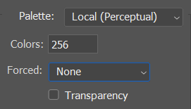
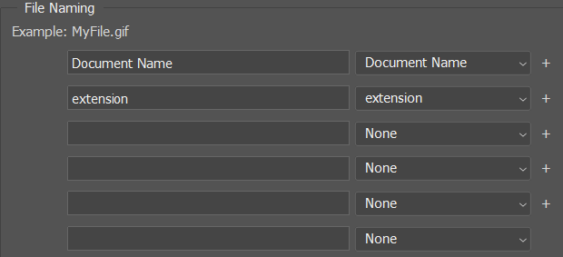

# How to make images in right format?
Sadly, I don't know if there is any way eaier than this
So, Why not just follow these steps?
## 1.In Photoshop
 - 1.find the most colorful image in your video.
 - 2.open it in Photoshop, click `Image`>`Mode`>`Indexed Color`
 - 3.make sure color convert argument looks like this  

 - 4.click on `Image`>`Mode`>`Color Table`
 - 5.click `Save` in the window
 - 6.click `Window`>`Actions`, an new window will popup
 - 7.click `Create new action`, and name it whatever you want, here I'll say it's `Action 1`
 - 8.there will be an red circle button on the Action window, That means you're in record mode, keep it.
 - 9.open another image (not neccessary to be an image from your video)
 - 10.in action record mode, click `Image`>`Mode`>`Indexed Color`
 - 11.in the color convert window, open the `Palette` sub menu and select `Custom`
 - 12.Click `load` in the palette editor, and select the palette we just saved.
 - 13.look at the action window and press the square button to stop recording
 - 14.click `File`>`Automate`>`Batch`
 - 15.in the `Play` area, set the Action to the action we just saved, in my case, it's `Action 1`
 - 16.in the `Source` area, make the source `folder`, and click `Choose` and select `res/gfx`
 - 17.in the `Destination` area, make the destination `folder`, again, click `Choose` and select `res/gfx`
 - 18.make sure the `File Naming` area looks like this  
 
 - 19.click `Okay`, and now photoshop will process every image for you.
 
